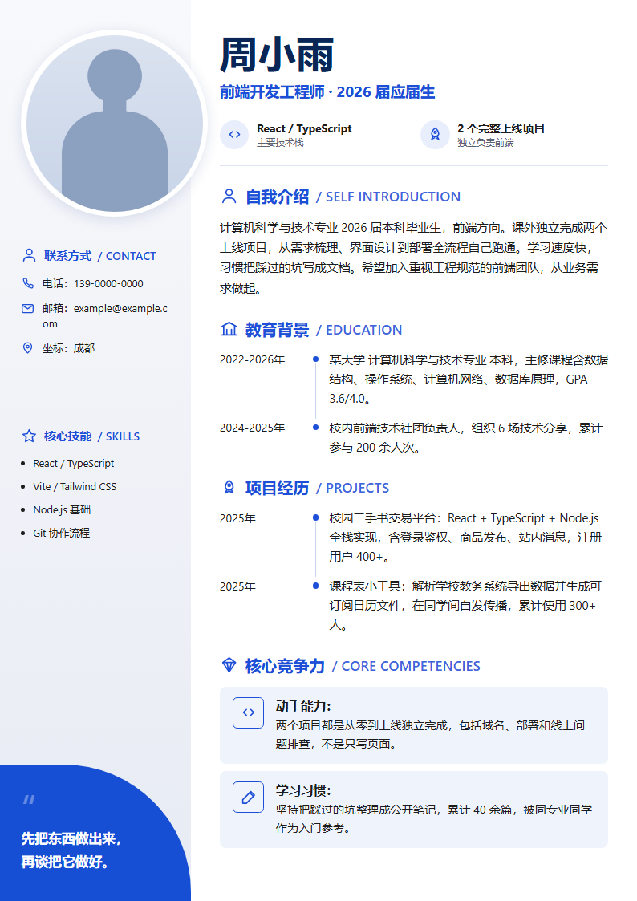
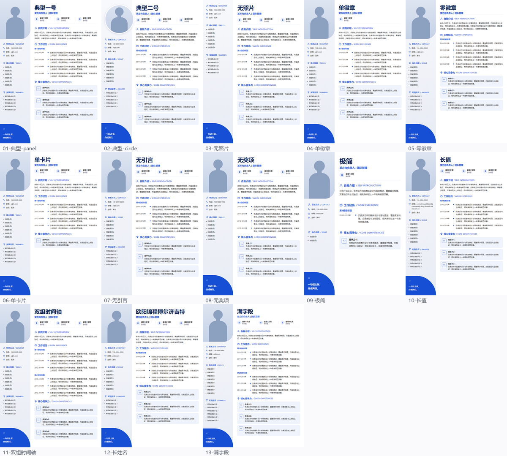

# 简历skill

把「一张照片 + 一份人物信息」渲染成一页 A4 简历。**风格固定，内容可换，同一套模板服务任何人。**

<p align="center">
  
  &nbsp;&nbsp;
  
</p>

<p align="center"><sub>左：内容饱满的资深候选人（自动缩到 97%）　右：材料很薄的应届生（自动放大到 112%）　两份都是同一套模板</sub></p>

---

## 为什么不直接让 AI 画一张简历图

因为**那张图里一个字都搜不到**。

让大模型生成简历图片，产物是纯像素。实测一份 AI 生成的简历 PDF：

| | AI 生成的简历图 | 本项目 |
|---|---|---|
| 可提取文字 | **0 字符** | 1000+ 字符 |
| HR 系统解析 | 解析为空 | 正常 |
| 对方复制你的电话 | 做不到 | 选中即可 |
| 文件体积 | 1.8 MB | ~200 KB |
| 改「12年」成「15年」 | 反推底图字体 → 字形 IoU 匹配 → 逐像素 alpha 合成 | 改 YAML 一行，重跑 3 秒 |

最后一行是这个项目的由来。为了改一份图片式简历里的 7 处文字，代价是一整天。

## 快速上手

```bash
git clone https://github.com/Zaosusu/resume-onepager.git && cd resume-onepager
pip install -r requirements.txt
playwright install chromium            # 首次需要，约 150MB

python scripts/render_resume.py examples/full.yaml -o out
```

`out/` 下会出现三个文件：`*.pdf`（带文字层，投递用）、`*.png`（预览用）、`_resume.html`（想手改样式时直接打开调）。

做自己的简历（多用户隔离版）：

```bash
mkdir -p data/你的名字 && cp examples/full.yaml data/你的名字/me.yaml
# 把照片放进 data/你的名字/，改 me.yaml 里的 photo 指向它，然后改内容
python scripts/render_resume.py data/你的名字/me.yaml -o data/你的名字
```

`data/` 下每个用户一个隔离子目录，已被 `.gitignore` 忽略，**个人信息与照片不会误提交到公开仓库**。
更省事的方式是用多用户助手：`python scripts/render_user.py new 你的名字 [--photo 照片路径]` 一步建好隔离目录与脚手架，`python scripts/render_user.py 你的名字` 渲染（自动 `data/<id>/me.yaml → data/<id>/`，源与成品同目录）。
隔离模型、目录结构与新增用户命令见 [`data/README.md`](data/README.md)。

## 数据长什么样

一份 YAML。除 `name` 外全部可选，**缺失即整段不渲染**——不留空标题、不留空白块。

```yaml
name: 林知远
alias: 阿远
title: 资深后端架构师 | 高并发系统与技术团队负责人

photo: assets/photo.png
photo_style: panel               # panel=左栏顶部出血大图；circle=圆形头像

badges:
  - {icon: rocket, main: 11年后端研发, sub: 电商/支付/中台}

contact:  {phone: "138-0000-0000", email: "a@b.com", location: 杭州}
skills:   [分布式系统与微服务架构, Go / Java / Kubernetes]
awards:   [公司年度技术突破奖 两届]

intro: |
  11年后端研发与架构经验……

experience:
  - role: 资深架构师 / 技术负责人
    items:
      - {period: 2021-至今, text: 负责交易中台整体架构……}

competencies:
  - {icon: code, title: 技术深度, text: 从数据库索引到分布式事务……}

quote: |
  好的架构是演进出来的，
  不是一次设计出来的。
```

完整字段说明见 [SKILL.md](SKILL.md#数据契约)，包含 `education` / `projects` / `labels`（改段落标题，可做英文版）等。

两份示例可以直接对着改：

- [`examples/full.yaml`](examples/full.yaml) —— 资深候选人，三徽章、双组时间轴、三张竞争力卡全开
- [`examples/minimal.yaml`](examples/minimal.yaml) —— 应届生，没有 awards、只有 2 张卡，演示内容少时的表现

## 自测试

```bash
python tests/smoke.py
```

程序化生成 13 份人物（字段数量 × 照片样式 × 内容密度的组合矩阵），全部渲染并断言：
退出码为 0、PDF 恰好 1 页、PNG 尺寸正确、自检通过。另外验证 5 条**必须失败**的路径——
缺 `name`、照片路径错、未知图标名、内容超一页、CSS 被 HTML 转义——每条都要以特定
退出码失败，且输出里带可操作的信息。

最后把所有产物拼成一张 contact sheet。**断言只能保证不崩，拼版才能看出丑。**
这个项目最严重的三个缺陷——CSS 被转义导致整套规则失效、头像被渲染成椭圆、
未知图标画出空框——全是看图发现的，没有一个是靠读代码推理出来的。



<sub>同一套模板吃下 13 种内容形态：有无照片、圆形头像 / 出血大图、徽章 0–3 个、
卡片 1–3 张、有无引言块、超长邮箱、九字姓名、双组时间轴、内容薄到把字号顶到放大上限。
**图里的文字是填充内容，不是范例数据** —— 这张图证明的是版面不跑版，
真正可以照着改的范例是 `examples/` 下那两份。</sub>

## 一页是硬上限

脚本双向自适应，都是自动的：

```
内容多 → 逐级缩小整体字号（到 0.85）
         缩到底还装不下 → 报错退出，打印各段实际高度，指出最长的几段
内容少 → 逐级放大（到 1.20），再把剩余高度分摊到两栏段间距
         右栏仍不足页高 78% → 打印提示，告诉你这是内容量问题
```

**一页的判据是 PDF 自己的页数，不是屏幕高度。** `page.pdf()` 会按打印媒介重新排版，
字体度量与屏幕略有差异，屏幕上「正好装下」的内容在 PDF 里可能溢出成第二页。
所以脚本出完 PDF 会数页数，超了就自动降一档重出。

左栏和徽章的字号只跟随缩小、不跟随放大。它们横向受限（左栏固定 30% 宽、
徽章横向三等分），跟着放大只会把电话号码、邮箱、徽章文案挤到折行。

**装不下时脚本不会替你截断。** 因为那是内容问题，不是排版问题——它会告诉你哪段最长，你自己删。

## 跟 AI 编程助手一起用

仓库根目录的 [`SKILL.md`](SKILL.md) 是给 Claude Code 之类的编程助手看的技能说明。把整个目录放进 `.claude/skills/` 即可：

```bash
# 项目级（只在当前项目生效）
cp -r resume-onepager <你的项目>/.claude/skills/
# 或全局
cp -r resume-onepager ~/.claude/skills/
```

之后直接说「把这份履历做成简历」，它会读你的 md / docx / 纯文本，自己整理成 YAML 再渲染。

**为什么「材料 → YAML」这一步交给模型而不是写解析器**：从一份 6000 字履历里挑出哪三条够格当徽章、把 4 行 bullet 压成卡片里的两行、判断哪三项算「核心竞争力」，全是语义判断。输入形态还可能是 docx、粘贴的纯文本、或几句口述。写代码解析必然脆弱。脚本只负责确定性渲染：给定 YAML 必然产出同样的 PDF。

SKILL.md 里明确写了**事实不得编造或美化，材料里没有的字段留空，自相矛盾的地方要问用户**。

## 调照片

照片先 `object-fit: cover` 填满容器，再以 `photo_focus` 为原点按 `photo_zoom` 放大。

| 症状 | 调法 |
|---|---|
| 人脸被裁掉一半 | 调 `photo_focus`，人脸偏上就**减小** y |
| 人物在框里偏低，想让头部落在上三分之一 | **增大** `photo_focus` 的 y（焦点下移 = 人物相对上移） |
| 只剩一张脸，看不到肩膀 | **减小** `photo_zoom` |
| 头像太小 | panel 加大 `photo_height`；circle 加大 `photo_size` |
| 横构图照片 | 必须用 `circle`。panel 是竖长版面，横图会被裁成中间一小块 |

**只要原图是标准人像取景（头部在画幅上三分之一），这三个参数都不用写**，默认值就是对的。

不需要抠图——裁切和圆形遮罩都由 CSS 完成。

## 换配色

`template/style.css` 顶部的 `:root`，改这里就够了：

```css
--accent:      #1D4ED8;   /* 主色：段标题、图标、副标题 */
--accent-blob: #164ED4;   /* 左下引言色块 */
--name:        #092657;   /* 姓名 */
--card:        #EFF3FB;   /* 竞争力卡片底 */
--side-w:      30%;       /* 左栏宽度 */
```

改完重新渲染 `examples/full.yaml` 和 `examples/minimal.yaml` 做回归，肉眼比对不应跑版。

## 目录结构

```
├── SKILL.md                    给 AI 编程助手看的技能说明
├── data/                       用户数据（多用户隔离，git 忽略，不上传）
│   ├── .gitkeep                维持空目录骨架（会被提交）
│   └── <用户>/                 ｜每个人一个隔离子目录：me.yaml + 照片
├── template/
│   ├── resume.html.j2          版面结构（Jinja2）
│   ├── style.css               设计令牌 + 全部样式
│   └── icons.html              14 个内联 SVG 图标，零网络依赖
├── scripts/
│   ├── render_resume.py        YAML → PDF + PNG，含一页自适应与自检
│   ├── render_user.py          多用户助手：data/<id>/me.yaml → out/<id>/
│   └── make_placeholder.py     生成示例用的合成占位人像
├── tests/
│   └── smoke.py                人物矩阵 + 错误路径断言 + 产物拼版
└── examples/
    ├── full.yaml  minimal.yaml
    └── assets/placeholder.png
```

## 已知限制

- **只有一种版式、一种配色思路**。要别的风格得自己改 CSS
- **段落标题默认中文**（英文副标题并排）。做纯英文简历要在 YAML 里重写 `labels`
- **左栏宽度固定 30%**，超过约 19 个字符的邮箱会折行
- **材料太薄时，模板能保证不难看，保证不了有分量**。放大字号和分摊间距只能填满版面，填不满内容
- **只在 Windows 上实测过**。字体栈按 macOS / Linux 补了 `PingFang SC` /
  `Noto Sans CJK SC` / `Source Han Sans SC`，但**未在这两个平台实际渲染验证**。
  Linux / Docker 里需要 `fonts-noto-cjk`，否则中文是方框。
  跑一次 `python scripts/render_resume.py examples/full.yaml -o out` 看 `out/*.png`
  即可自查；有问题欢迎提 issue 附上截图
- 徽章 `main` 超过 8 个汉字会折行——三个徽章是横向三等分的

## 技术选型

| 用途 | 选择 | 为什么 |
|---|---|---|
| 渲染 | Playwright + Chromium | 同时产出带文字层的 PDF 和高分 PNG |
| 模板 | Jinja2 | — |
| 数据 | YAML | 比 JSON 适合手写多行中文 |
| 校验 | PyMuPDF | 验证页数与文字层 |

**没有用 weasyprint**：多数环境缺 `libpango`，且对 flex 支持不全。

示例里的占位人像是 `scripts/make_placeholder.py` 用代码画的，不是真人照片——公开分发没有肖像权负担。

## License

[MIT](LICENSE)。版式为原创 CSS 实现，配色与构图为常见双栏简历样式。
